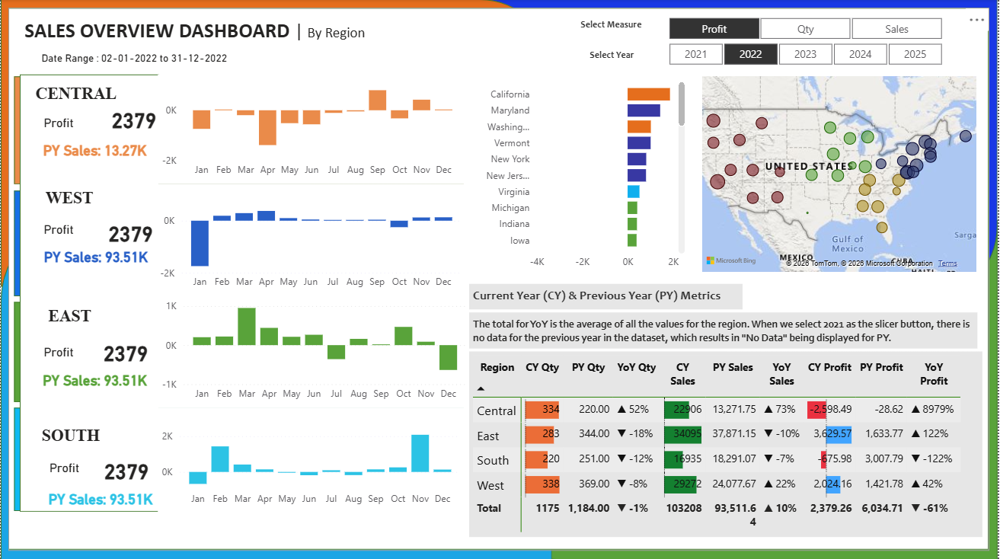

# Sales Overview Analysis Report

An interactive Power BI dashboard that analyzes current and previous year sales performance across regions using KPIs, YoY metrics, and dynamic slicers.

## Objective
To provide a clear overview of sales performance and help stakeholders make data-driven decisions.

## Key Insights
- Region-wise sales, profit, and quantity analysis
- Current Year (CY) vs Previous Year (PY) comparison
- Year-over-Year (YoY) growth metrics
- Monthly performance trends
- Interactive measure and year selection

## Tools & Technologies
- Power BI
- DAX
- Excel (Data Source)

## Dashboard Features
- Dynamic measure selector (Sales, Profit, Quantity)
- Year slicer (2021–2025)
- Region-wise trend analysis
- Geographic sales visualization
- KPI comparison table with YoY indicators

## Use Case
This dashboard can be used by business users and management teams to monitor performance, identify growth opportunities, and track regional trends.
